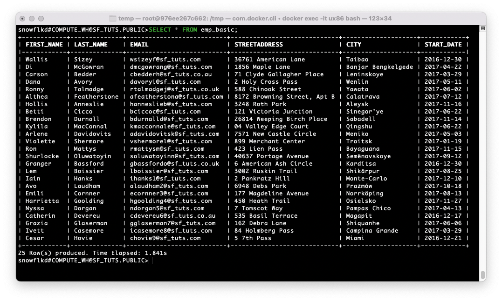

# Snowflake
Summary notes on snowflake.

## SnowSQL Installation

### 0. Linux Container

The `--platform linux/x86_64` is needed on M1 macbook [credit](https://stackoverflow.com/a/69075554).

```
docker run --platform linux/x86_64 -d -t -p 8080:80 --name ux86 ubuntu:22.04
```

Check running containers via `docker ps`:
```
CONTAINER ID   IMAGE          COMMAND       CREATED          STATUS          PORTS                  NAMES
976ee267c662   ubuntu:22.04   "/bin/bash"   58 seconds ago   Up 57 seconds   0.0.0.0:8080->80/tcp   ux86
```

bash on the container:
```
docker exec -it ux86 bash
```

Install packages:
```
apt install curl gpg zip unzip
```


### 1: Download

```shell
# download the installer (AWS)
curl -O https://sfc-repo.snowflakecomputing.com/snowsql/bootstrap/1.3/linux_x86_64/snowsql-1.3.2-linux_x86_64.bash

# download the key
curl -O https://sfc-repo.snowflakecomputing.com/snowsql/bootstrap/1.3/linux_x86_64/snowsql-1.3.2-linux_x86_64.bash.sig

# dowanload the public key from the keyserver
# SnowSQL 1.2.24 and higher
gpg --keyserver hkp://keyserver.ubuntu.com --recv-keys 630D9F3CAB551AF3
```

<details>

```
root@976ee267c662:~/temp# curl -O https://sfc-repo.snowflakecomputing.com/snowsql/bootstrap/1.3/linux_x86_64/snowsql-1.3.2-linux_x86_64.bash
  % Total    % Received % Xferd  Average Speed   Time    Time     Time  Current
                                 Dload  Upload   Total   Spent    Left  Speed
100 47.9M  100 47.9M    0     0  7259k      0  0:00:06  0:00:06 --:--:-- 7641k
root@976ee267c662:~/temp# curl -O https://sfc-repo.snowflakecomputing.com/snowsql/bootstrap/1.3/linux_x86_64/snowsql-1.3.2-linux_x86_64.bash.sig
  % Total    % Received % Xferd  Average Speed   Time    Time     Time  Current
                                 Dload  Upload   Total   Spent    Left  Speed
100   543  100   543    0     0    926      0 --:--:-- --:--:-- --:--:--   937
root@976ee267c662:~/temp# gpg --keyserver hkp://keyserver.ubuntu.com --recv-keys 630D9F3CAB551AF3
gpg: directory '/root/.gnupg' created
gpg: keybox '/root/.gnupg/pubring.kbx' created
gpg: /root/.gnupg/trustdb.gpg: trustdb created
gpg: key 630D9F3CAB551AF3: public key "Snowflake Computing (Snowflake Computing Gpg Key) <snowflake_gpg@snowflake.net>" imported
gpg: Total number processed: 1
gpg:               imported: 1
```
  
</details>


### 2. Verify
```
# verify
gpg --verify snowsql-1.3.2-linux_x86_64.bash.sig snowsql-1.3.2-linux_x86_64.bash
```

Output:
```
gpg: Signature made Thu Aug  8 10:49:39 2024 UTC
gpg:                using RSA key 630D9F3CAB551AF3
gpg: Good signature from "Snowflake Computing (Snowflake Computing Gpg Key) <snowflake_gpg@snowflake.net>" [expired]
gpg: Note: This key has expired!
Primary key fingerprint: 23D8 08A5 B09A 9CB3 4610  C0B2 630D 9F3C AB55 1AF3
```

Delete the public key for security.
```
gpg --delete-key "Snowflake Computing"
```

Output:
```
gpg (GnuPG) 2.2.27; Copyright (C) 2021 Free Software Foundation, Inc.
This is free software: you are free to change and redistribute it.
There is NO WARRANTY, to the extent permitted by law.


pub  rsa4096/630D9F3CAB551AF3 2022-09-20 Snowflake Computing (Snowflake Computing Gpg Key) <snowflake_gpg@snowflake.net>

Delete this key from the keyring? (y/N) y
```

### 3: Install

```shell
# install SnowSQL
bash snowsql-1.3.2-linux_x86_64.bash

# create an alias
echo -e "\nalias snowsql='~/bin/snowsql'" >>  ~/.bashrc

# apply changes
. ~/.bashrc 

# Check version
snowsql -v
# Version: 1.3.2
```

<details>
  
```
root@976ee267c662:~/temp# bash snowsql-1.3.2-linux_x86_64.bash
**********************************************************************
 Installing SnowSQL, Snowflake CLI.
**********************************************************************

Specify the directory in which the SnowSQL components will be installed. [~/bin] 
Do you want to add /root/bin to PATH in /root/.profile? [y/N] y
Updating /root/.profile to have /root/bin in PATH
Open a new terminal session to make the updated PATH take effect.
**********************************************************************
 Congratulations! Follow the steps to connect to Snowflake DB.
**********************************************************************

1. Open a new terminal window.
2. Execute the following command to test your connection:
      snowsql -a <account_name> -u <login_name>

      Enter your password when prompted. Enter !quit to quit the connection.

3. Add your connection information to the ~/.snowsql/config file:
      accountname = <account_name>
                username = <login_name>
                password = <password>

4. Execute the following command to connect to Snowflake:

      snowsql

See the Snowflake documentation <https://docs.snowflake.net/manuals/user-guide/snowsql.html> for more information.

root@976ee267c662:~# echo -e "\nalias snowsql='~/bin/snowsql'" >>  ~/.bashrc
root@976ee267c662:~# . ~/.bashrc 
root@976ee267c662:~# snowsql -v
Version: 1.3.2
```

</details>

### 4. Log In

```shell
snowsql -a <accountname> -u <username>
# prompt for password
```

`accountname` is the tricky part. Example: `id12345.ca-central-1.aws` where `id12345` is the locater. All information available via ADMIN/Account menu ([more](https://docs.snowflake.com/en/user-guide/admin-account-identifier)). 

Output:
```
* SnowSQL * v1.3.2
Type SQL statements or !help
snowflkd#COMPUTE_WH@(no database).(no schema)>
```

Authentications can be added to `~/.snowsql/config` file ([more](https://docs.snowflake.com/en/user-guide/snowsql-config)). Since password will be in plain text, this enhances the security by limiting the read permission to you:

```
$ chmod 700 ~/.snowsql/config
```

## Getting Started

Loading CSV files to Snowflake [Source](https://docs.snowflake.com/en/user-guide/tutorials/snowflake-in-20minutes#introduction).

### Create Snowflake Objects 

```sql
-- Databse
CREATE OR REPLACE DATABASE sf_tuts;

SELECT CURRENT_DATABASE(), CURRENT_SCHEMA();

-- Table
CREATE OR REPLACE TABLE emp_basic (
   first_name STRING ,
   last_name STRING ,
   email STRING ,
   streetaddress STRING ,
   city STRING ,
   start_date DATE
   );

-- Warehouse
CREATE OR REPLACE WAREHOUSE sf_tuts_wh WITH
   WAREHOUSE_SIZE='X-SMALL'
   AUTO_SUSPEND = 180
   AUTO_RESUME = TRUE
   INITIALLY_SUSPENDED=TRUE;

SELECT CURRENT_WAREHOUSE();
```

### Stage Data Files

Sample CSV files:

```shell
cd /tmp
wget https://docs.snowflake.com/en/_downloads/34f4a66f56d00340f8f7a92acaccd977/getting-started.zip
unzip getting-started.zip
ls
# employees01.csv  employees02.csv  employees03.csv  employees04.csv  employees05.csv  getting-started.zip
```

Stage sample files:

```sql
PUT file:///tmp/employees0*.csv @sf_tuts.public.%emp_basic;
```

```
+-----------------+--------------------+-------------+-------------+--------------------+--------------------+----------+---------+
| source          | target             | source_size | target_size | source_compression | target_compression | status   | message |
|-----------------+--------------------+-------------+-------------+--------------------+--------------------+----------+---------|
| employees01.csv | employees01.csv.gz |         370 |         304 | NONE               | GZIP               | UPLOADED |         |
| employees02.csv | employees02.csv.gz |         364 |         288 | NONE               | GZIP               | UPLOADED |         |
| employees03.csv | employees03.csv.gz |         407 |         304 | NONE               | GZIP               | UPLOADED |         |
| employees04.csv | employees04.csv.gz |         375 |         304 | NONE               | GZIP               | UPLOADED |         |
| employees05.csv | employees05.csv.gz |         404 |         304 | NONE               | GZIP               | UPLOADED |         |
+-----------------+--------------------+-------------+-------------+--------------------+--------------------+----------+---------+
5 Row(s) produced. Time Elapsed: 1.708s
```

List the staged files:
```sql
LIST @sf_tuts.public.%emp_basic;
```

```
+--------------------+------+----------------------------------+-------------------------------+
| name               | size | md5                              | last_modified                 |
|--------------------+------+----------------------------------+-------------------------------|
| employees01.csv.gz |  304 | e03cfcf9e190fd23d62ae8d374bced28 | Wed, 18 Dec 2024 03:27:11 GMT |
| employees02.csv.gz |  288 | d5fe7c0ccacebe501c9fa79db6f7cd37 | Wed, 18 Dec 2024 03:27:10 GMT |
| employees03.csv.gz |  304 | a89fe832a955cb2a6c0d8dce3c3b7b18 | Wed, 18 Dec 2024 03:27:11 GMT |
| employees04.csv.gz |  304 | bee9064100fd3f936ebde7cdca060e6e | Wed, 18 Dec 2024 03:27:11 GMT |
| employees05.csv.gz |  304 | ff0b252271181797e89070371e9a0f8a | Wed, 18 Dec 2024 03:27:11 GMT |
+--------------------+------+----------------------------------+-------------------------------+
5 Row(s) produced. Time Elapsed: 0.200s
```

### Copy Data into Target Table

```sql
COPY INTO emp_basic
  FROM @%emp_basic
  FILE_FORMAT = (type = csv field_optionally_enclosed_by='"')
  PATTERN = '.*employees0[1-5].csv.gz'
  ON_ERROR = 'skip_file';
```

```
+--------------------+--------+-------------+-------------+-------------+-------------+-------------+------------------+-----------------------+-------------------------+
| file               | status | rows_parsed | rows_loaded | error_limit | errors_seen | first_error | first_error_line | first_error_character | first_error_column_name |
|--------------------+--------+-------------+-------------+-------------+-------------+-------------+------------------+-----------------------+-------------------------|
| employees04.csv.gz | LOADED |           5 |           5 |           1 |           0 | NULL        |             NULL |                  NULL | NULL                    |
| employees03.csv.gz | LOADED |           5 |           5 |           1 |           0 | NULL        |             NULL |                  NULL | NULL                    |
| employees05.csv.gz | LOADED |           5 |           5 |           1 |           0 | NULL        |             NULL |                  NULL | NULL                    |
| employees01.csv.gz | LOADED |           5 |           5 |           1 |           0 | NULL        |             NULL |                  NULL | NULL                    |
| employees02.csv.gz | LOADED |           5 |           5 |           1 |           0 | NULL        |             NULL |                  NULL | NULL                    |
+--------------------+--------+-------------+-------------+-------------+-------------+-------------+------------------+-----------------------+-------------------------+
5 Row(s) produced. Time Elapsed: 2.351s
```

### Query Loaded Data

```sql
SELECT * FROM emp_basic;
```

```
+------------+--------------+---------------------------+-----------------------------+--------------------+------------+
| FIRST_NAME | LAST_NAME    | EMAIL                     | STREETADDRESS               | CITY               | START_DATE |
|------------+--------------+---------------------------+-----------------------------+--------------------+------------|
| Wallis     | Sizey        | wsizeyf@sf_tuts.com       | 36761 American Lane         | Taibao             | 2016-12-30 |
| Di         | McGowran     | dmcgowrang@sf_tuts.com    | 1856 Maple Lane             | Banjar Bengkelgede | 2017-04-22 |
| Carson     | Bedder       | cbedderh@sf_tuts.co.au    | 71 Clyde Gallagher Place    | Leninskoye         | 2017-03-29 |
| Dana       | Avory        | davoryi@sf_tuts.com       | 2 Holy Cross Pass           | Wenlin             | 2017-05-11 |
| Ronny      | Talmadge     | rtalmadgej@sf_tuts.co.uk  | 588 Chinook Street          | Yawata             | 2017-06-02 |
| Althea     | Featherstone | afeatherstona@sf_tuts.com | 8172 Browning Street, Apt B | Calatrava          | 2017-07-12 |
| Hollis     | Anneslie     | hanneslieb@sf_tuts.com    | 3248 Roth Park              | Aleysk             | 2017-11-16 |
| Betti      | Cicco        | bciccoc@sf_tuts.com       | 121 Victoria Junction       | Sinegor'ye         | 2017-06-22 |
| Brendon    | Durnall      | bdurnalld@sf_tuts.com     | 26814 Weeping Birch Place   | Sabadell           | 2017-11-14 |
| Kylila     | MacConnal    | kmacconnale@sf_tuts.com   | 04 Valley Edge Court        | Qingshu            | 2017-06-22 |
| Arlene     | Davidovits   | adavidovitsk@sf_tuts.com  | 7571 New Castle Circle      | Meniko             | 2017-05-03 |
| Violette   | Shermore     | vshermorel@sf_tuts.com    | 899 Merchant Center         | Troitsk            | 2017-01-19 |
| Ron        | Mattys       | rmattysm@sf_tuts.com      | 423 Lien Pass               | Bayaguana          | 2017-11-15 |
| Shurlocke  | Oluwatoyin   | soluwatoyinn@sf_tuts.com  | 40637 Portage Avenue        | Semënovskoye       | 2017-09-12 |
| Granger    | Bassford     | gbassfordo@sf_tuts.co.uk  | 6 American Ash Circle       | Kardítsa           | 2016-12-30 |
| Lem        | Boissier     | lboissier@sf_tuts.com     | 3002 Ruskin Trail           | Shikārpur          | 2017-08-25 |
| Iain       | Hanks        | ihanks1@sf_tuts.com       | 2 Pankratz Hill             | Monte-Carlo        | 2017-12-10 |
| Avo        | Laudham      | alaudham2@sf_tuts.com     | 6948 Debs Park              | Prażmów            | 2017-10-18 |
| Emili      | Cornner      | ecornner3@sf_tuts.com     | 177 Magdeline Avenue        | Norrköping         | 2017-08-13 |
| Harrietta  | Goolding     | hgoolding4@sf_tuts.com    | 450 Heath Trail             | Osielsko           | 2017-11-27 |
| Nyssa      | Dorgan       | ndorgan5@sf_tuts.com      | 7 Tomscot Way               | Pampas Chico       | 2017-04-13 |
| Catherin   | Devereu      | cdevereu6@sf_tuts.co.au   | 535 Basil Terrace           | Magapit            | 2016-12-17 |
| Grazia     | Glaserman    | gglaserman7@sf_tuts.com   | 162 Debra Lane              | Shiquanhe          | 2017-06-06 |
| Ivett      | Casemore     | icasemore8@sf_tuts.com    | 84 Holmberg Pass            | Campina Grande     | 2017-03-29 |
| Cesar      | Hovie        | chovie9@sf_tuts.com       | 5 7th Pass                  | Miami              | 2016-12-21 |
+------------+--------------+---------------------------+-----------------------------+--------------------+------------+
25 Row(s) produced. Time Elapsed: 1.841s
```

&nbsp;

<figcaption>Screenshot of the last query via snowsql, running on a Linux (Ubuntu) Docker container.</figcaption>




